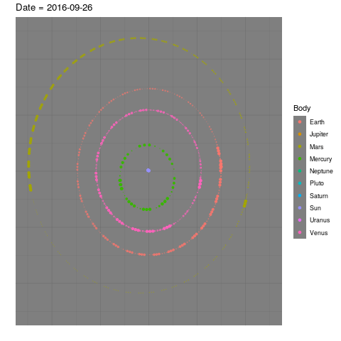
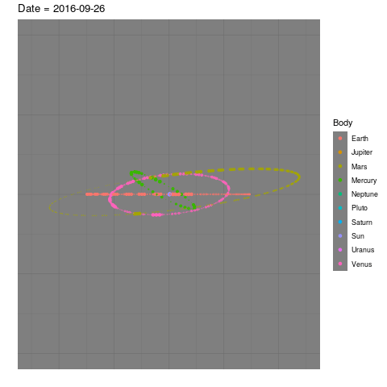
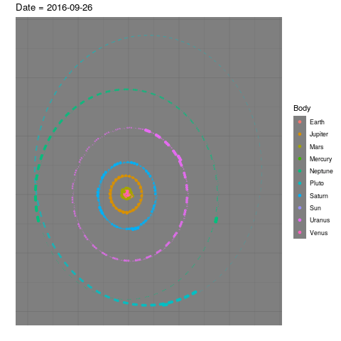
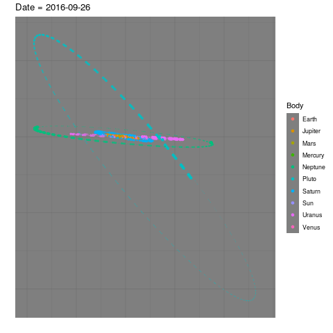
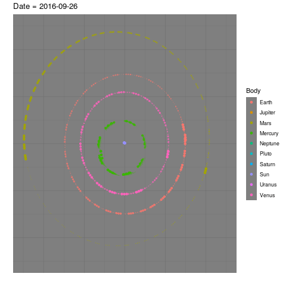
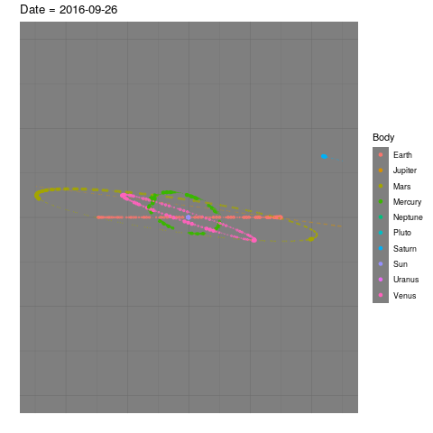
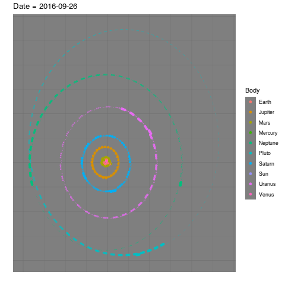
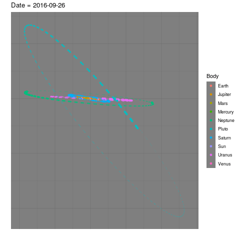
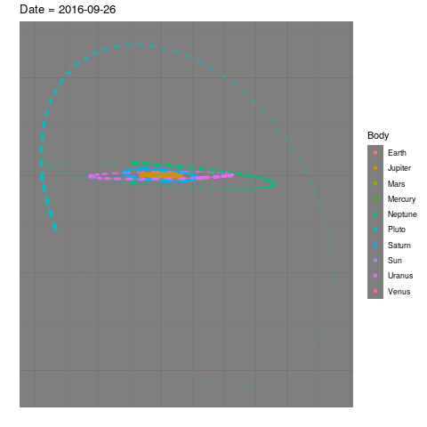

```{r setup, include=FALSE}
knitr::opts_chunk$set(echo = TRUE)
```

#### Utilizando Runge-Kutta

Primeiro, programo os métodos numéricos. Crio um método Runge-Kutta genérico,
que aceita uma matriz de butcher como parâmetro, e depois ponho rk4 como
uma aplicação parcial deste método com uma matriz específica.

```{r, message = FALSE}
library(tidyverse)
library(gganimate)
library(udunits2)

rungeKutta = function(M, f, y0, ts) {
  y = matrix(0, nrow = length(ts), ncol = length(y0))
  colnames(y) = if (is.null(names(y0))) paste0("y", 1:length(y0)) else names(y0)
  y[1,] = y0
  
  # butcher tableau
  c = M[1:(nrow(M)-1), 1]
  A = M[1:(nrow(M)-1), 2:ncol(M)]
  b = M[nrow(M), 2:ncol(M)]
  
  for (i in 1:(length(ts) - 1)) {
    h = ts[i + 1] - ts[i]
    K = matrix(0, nrow = nrow(A), ncol = length(y0))
    
    K[1,] = f(ts[i], y[i,])
    for (j in 2:nrow(K)) {
      K[j,] = f(ts[i] + h*c[j], y[i,] + h * as.vector(A[j, 1:(j-1)] %*% K[1:j-1,]))
    }
    
    y[i + 1,] = y[i,] + h*b %*% K
  }
  
  y
}

rk4 = function(f, y0, ts) {
  M = matrix(c(0, 0, 0, 0, 0, 
               .5, .5, 0, 0, 0,
               .5, 0, .5, 0, 0,
               1, 0, 0, 1, 0,
               0, 1/6, 1/3, 1/3, 1/6), byrow = TRUE, nrow = 5)
  
  rungeKutta(M, f, y0, ts)
}
```

Precisamos de dados. Coletei os parâmetros padrão de gravitação da [wikipedia][1]
e os ephemeris da [Horizons - NASA][2]. Precisamos fazer conversões de unidades,
pois os parâmetros de gravitação estão em $m^3s^{-2}$ e os ephemeris, em 
unidades astronômicas. Uso como unidade de distância $10^6 km$ por conveniência.

```{r, message = FALSE}
init = read_csv("../data/ephemerides-2018-09-26.csv") %>%
  mutate(sgp = ud.convert(sgp, "m^3/s^2", "(1e6*km)^3/(days^2)")) %>%
  mutate_at(vars(x, y, z), ~ ud.convert(., "au", "1e6km")) %>%
  mutate_at(vars(vx, vy, vz), ~ ud.convert(., "au/days", "1e6km/days"))

init
```

A função que passamos para o método RK4 tem como parâmetro o tempo e o estado,
que é um vetor com 60 componentes: cada corpo tem parâmetros x, y, z
e vx, vy, vz. Ou seja, estamos resolvendo um sistema com 60 equações diferenciais.

Não há muita novidade. A equação é: 

$$\frac{d²x_i}{dt²} = \sum_{j \neq i} \frac{\mu_j(x_j-x_i)}{\mid x_j-x_i \mid^3}$$

```{r}
f = function(t, state) {
  n = length(state)/6
  x = state[1:n]
  y = state[(n+1):(2*n)]
  z = state[(2*n+1):(3*n)]
  vx = state[(3*n+1):(4*n)]
  vy = state[(4*n+1):(5*n)]
  vz = state[(5*n+1):(6*n)]
  
  ax = ay = az = double(n)
  for (i in 1:n) {
    dx = x[-i] - x[i]
    dy = y[-i] - y[i]
    dz = z[-i] - z[i]
    r2 = dx^2 + dy^2 + dz^2
    ax[i] = init$sgp[-i] * dx / r2^1.5
    ay[i] = init$sgp[-i] * dy / r2^1.5
    az[i] = init$sgp[-i] * dz / r2^1.5
  }
  
  c(vx, vy, vz, ax, ay, az)
}
```

Por conveniência, crio um wrapper que gera os resultados, para uma sequência
$t_n$, já no formato adequado para os plots.

```{r}
make_tb = function(ts) {
  state0 = c(init$x, init$y, init$z, init$vx, init$vy, init$vz)
  res = rk4(f, state0, ts)
  
  tb = map_dfr(1:length(ts), function(i) {
    state = init
    n = nrow(state)
    state$x = res[i, 1:n]
    state$y = res[i, (n+1):(2*n)]
    state$z = res[i, (2*n+1):(3*n)]
    state$vx = res[i, (3*n+1):(4*n)]
    state$vy = res[i, (4*n+1):(5*n)]
    state$vz = res[i, (5*n+1):(6*n)]
    state$t = ts[i]
    state
  })
}
```

Gráficos para os planetas mais próximos ao sol (até marte):

```{r, eval = FALSE}
tb = make_tb(seq(0, 365*3, by = 2))
write_rds(tb, "published/short_run.rds")

tb %>%
ggplot(aes(x = x, y = y, color = Body)) + geom_point() + theme_dark() + 
  xlim(-250, 250) + ylim(-250, 250) + xlab("") + ylab("") +
  theme(
    axis.ticks.x = element_blank(),
    axis.text.x = element_blank(), 
    axis.text.y = element_blank(),
    axis.ticks.y = element_blank()
  ) + 
  transition_time(t) + ease_aes('linear') + 
  labs(title = "Date = {as.Date('2016-09-26') + as.difftime(frame_time, units = 'days')}") + 
  shadow_wake(1, size = .25, alpha = .25)

anim_save("solar_in_xy.gif", path = "published")

tb = make_tb(seq(0, 365*3, by = 2))
write_rds(tb, "published/short_run.rds")

tb %>%
  ggplot(aes(x = x, y = z, color = Body)) + geom_point() + theme_dark() + 
  xlim(-250, 250) + ylim(-50, 50) + xlab("") + ylab("") +
  theme(
    axis.ticks.x = element_blank(),
    axis.text.x = element_blank(), 
    axis.text.y = element_blank(),
    axis.ticks.y = element_blank()
  ) + 
  transition_time(t) + ease_aes('linear') + 
  labs(title = "Date = {as.Date('2016-09-26') + as.difftime(frame_time, units = 'days')}") + 
  shadow_wake(1, size = .25, alpha = .25)

anim_save("solar_in_xz.gif", path = "published")

tb %>%
  ggplot(aes(x = y, y = z, color = Body)) + geom_point() + theme_dark() + 
  xlim(-250, 250) + ylim(-50, 50) + xlab("") + ylab("") +
  theme(
    axis.ticks.x = element_blank(),
    axis.text.x = element_blank(), 
    axis.text.y = element_blank(),
    axis.ticks.y = element_blank()
  ) + 
  transition_time(t) + ease_aes('linear') + 
  labs(title = "Date = {as.Date('2016-09-26') + as.difftime(frame_time, units = 'days')}") + 
  shadow_wake(1, size = .25, alpha = .25)

anim_save("solar_in_yz.gif", path = "published")
```






Mesma coisa, mais com zoom out. Como plot apenas uma vez a cada 320 dias,
já que os períodos agora são muito mais longos.

```{r, eval = FALSE}
tb = make_tb(seq(0, 365*260, by = 2)) 
write_rds(tb, "published/long_run.rds")

tb %>%
  filter(t %% 160 == 0) %>%
ggplot(aes(x = x, y = y, color = Body)) + geom_point() + theme_dark() + 
  xlim(-5000, 7000) + ylim(-5000, 7000) + xlab("") + ylab("") +
  theme(
    axis.ticks.x = element_blank(),
    axis.text.x = element_blank(), 
    axis.text.y = element_blank(),
    axis.ticks.y = element_blank()
  ) + 
  transition_time(t) + ease_aes('linear') + 
  labs(title = "Date = {as.Date('2016-09-26') + as.difftime(frame_time, units = 'days')}") + 
  shadow_wake(1, size = .25, alpha = .25)

anim_save("solar_out_xy.gif", path = "published")

tb %>%
  filter(t %% 160 == 0) %>%
  ggplot(aes(x = x, y = z, color = Body)) + geom_point() + theme_dark() + 
  xlim(-5000, 7000) + ylim(-2200, 1400) + xlab("") + ylab("") +
  theme(
    axis.ticks.x = element_blank(),
    axis.text.x = element_blank(), 
    axis.text.y = element_blank(),
    axis.ticks.y = element_blank()
  ) + 
  transition_time(t) + ease_aes('linear') + 
  labs(title = "Date = {as.Date('2016-09-26') + as.difftime(frame_time, units = 'days')}") + 
  shadow_wake(1, size = .25, alpha = .25)

anim_save("solar_out_xz.gif", path = "published")

tb %>%
  filter(t %% 160 == 0) %>%
  ggplot(aes(x = y, y = z, color = Body)) + geom_point() + theme_dark() + 
  xlim(-5000, 7000) + ylim(-2200, 1400) + xlab("") + ylab("") +
  theme(
    axis.ticks.x = element_blank(),
    axis.text.x = element_blank(), 
    axis.text.y = element_blank(),
    axis.ticks.y = element_blank()
  ) + 
  transition_time(t) + ease_aes('linear') + 
  labs(title = "Date = {as.Date('2016-09-26') + as.difftime(frame_time, units = 'days')}") + 
  shadow_wake(1, size = .25, alpha = .25)

anim_save("solar_out_yz.gif", path = "published")
```





#### Utilizando Verlet

Aqui, apresento os resultados utilizando integração verlet. Aqui, a implementação
do método.

```{r}
verlet = function(f, y0, dy0, ts) {
  dt = ts[2] - ts[1]
  y = matrix(0, nrow = length(ts), ncol = length(y0))
  y[1,] = y0
  y[2,] = y0 + dy0*dt + f(y0)*dt*dt/2
  
  for (i in 3:length(ts)) {
    y[i,] = 2*y[i-1,] - y[i-2,] + f(y[i-1,])*dt*dt
  }
  
  y
}

fv = function(state) {
  n = length(state)/3
  x = state[1:n]
  y = state[(n+1):(2*n)]
  z = state[(2*n+1):(3*n)]
  
  ax = ay = az = double(n)
  for (i in 1:n) {
    dx = x[-i] - x[i]
    dy = y[-i] - y[i]
    dz = z[-i] - z[i]
    r2 = dx^2 + dy^2 + dz^2
    ax[i] = init$sgp[-i] * dx / r2^1.5
    ay[i] = init$sgp[-i] * dy / r2^1.5
    az[i] = init$sgp[-i] * dz / r2^1.5
  }
  
  c(ax, ay, az)
}

make_tbv = function(ts) {
  state0 = c(init$x, init$y, init$z)
  velocity0 = c(init$vx, init$vy, init$vz)
  res = verlet(fv, state0, velocity0, ts)
  
  map_dfr(1:length(ts), function(i) {
    state = init
    n = nrow(state)
    state$x = res[i, 1:n]
    state$y = res[i, (n+1):(2*n)]
    state$z = res[i, (2*n+1):(3*n)]
    state$t = ts[i]
    state
  })
}
```

O código para gerar os plots é, *mutatis mutandis*, o mesmo. Vamos para os plots:

##### De perto:





##### De longe:





[1]: https://en.wikipedia.org/wiki/Standard_gravitational_parameter
[2]: https://ssd.jpl.nasa.gov/horizons.cgi#top

